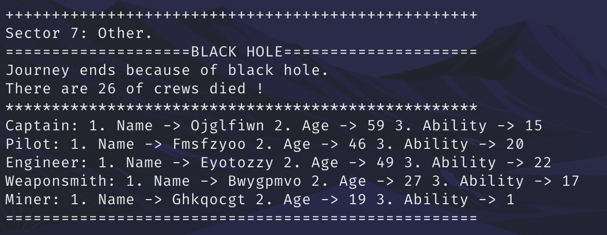

# ASS2

## Description

For the construction of spaceships, first we randomly initialize 10 spaceships, and select 1 of them to start the journey. The HP range of the spaceship is (100, 500), the capacity range is (200, 500), the attack ability value range is (50, 200), and the defense ability value range is (80, 300).

For the construction of officer, first we randomize the name of each crew, the length is 8. Secondly, the age range of the captain is (30, 60), the ability range is (10, 25); the age range of the pilot is (18, 60), the ability range is (5, 25); the age range of the engineer is (18, 60), the range of ability is (10, 25); the age range of weaponsmith is (18, 60), the ability range is (1, 20); the age range of miner is (18, 60), and the ability range is (1, 20). )

For the type of alien civilization, the value range is (2200, 8800) to represent a huge and unknown civilization.

## Output

## Interactions
### Encounter spaceship
Win:

Lose:

### Encounter planet

### Encounter trading station

### Black hole

## UML Design
