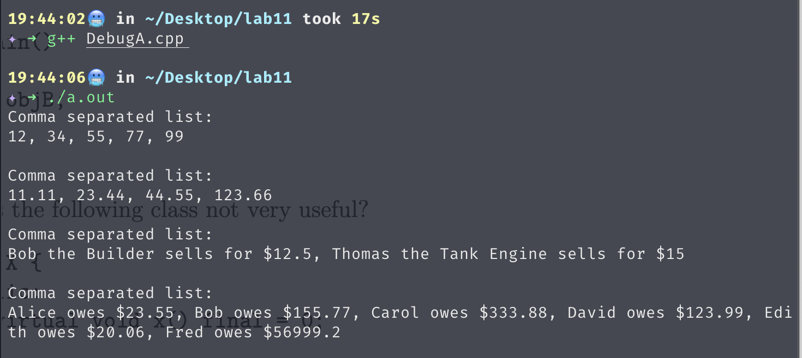
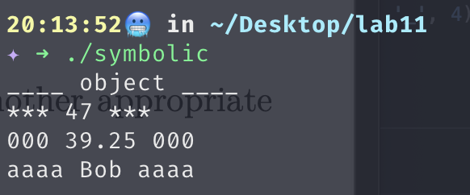
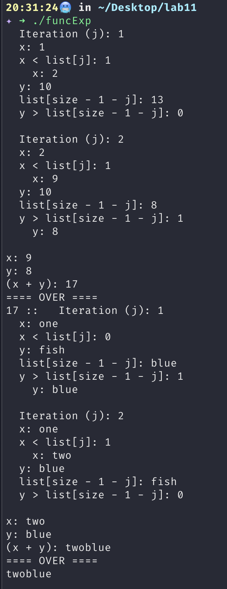
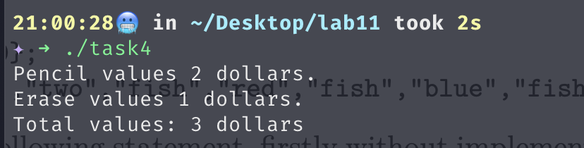

# LAB 11

## Task 1
### Task 1.1
```C++
#include <iostream>
using namespace std;

class B {
    public:
        virtual void X() = 0;
};

class D : B {
    public:
        virtual void X() {cout << "D object" << endl;}
};

int main() {
    D objD;
}
```

### Task 1.2
The class is useless because the function is pure virtual, meaning the class is abstract, it cannot be instantiated. But the final keyword prevents the derived class from overriding the function. In result, any derived class will itself become another derived class because it cannot cover any functions.

### Task 1.3


## Task 2


## Task 3
```C++
#include <iostream>
#include <string>
using namespace std;

template <typename T>
T funcExp(T list[], int size) {
    int j;
    T x = list[0];
    T y = list[size - 1];

    for (j = 1; j < (size - 1) / 2; j++) {
        cout << "  Iteration (j): " << j << endl;
        cout << "  x: " << x << endl;
        cout << "  x < list[j]: " << (x < list[j]) << endl;

        if (x < list[j]) {
            x = list[j];
            cout << "    x: " << x << endl;
        }

        cout << "  y: " << y << endl;
        cout << "  list[size - 1 - j]: " << list[size - 1 - j] << endl;
        cout << "  y > list[size - 1 - j]: " << (y > list[size - 1 - j]) << endl;

        if (y > list[size - 1 - j]) {
            y = list[size - 1 - j];
            cout << "    y: " << y << endl;
        }

        cout << endl;
    }

    cout << "x: " << x << endl;
    cout << "y: " << y << endl;
    cout << "(x + y): " << (x + y) << "\n" 
        <<"==== OVER ===="<<endl;

    return (x + y);
}

int main() {
    int list[8] = {1, 2, 9, 3, 5, 8, 13, 10};
    string strlist[] = {"one", "fish", "two", "fish", "red", "fish", "blue", "fish"};

    cout<< funcExp(list, 8) << " :: " << funcExp(strlist, 8) << endl;

    return 0;
}
```



## Task 4
```C++
#include <iostream>
using namespace std;

template<typename R, typename S>
class Two {
    private:
        R r;
        S s;
    public:
        Two(R first, S second);
        void display();
        int total();
};

template<typename R, typename S>
Two<R, S>::Two(R first, S second) : r(first), s(second) {
}

template<typename R, typename S>
void Two<R, S>::display() {
    cout << r << "\n"
         << s << endl;
}

template<typename R, typename S>
int Two<R, S>::total() {
    return r + s;
}

class Pencil;
class Erase;

class Pencil {
        friend ostream& operator<<(ostream &out, const Pencil &pencil);
    public:
        Pencil(int value);
        friend int operator+(const Pencil &pencil, const Erase &erase);
        friend int operator+(const Erase &erase, const Pencil &pencil);

    private:
        int m_Value;
};

Pencil::Pencil(int value) : m_Value(value) {
}

ostream& operator<<(ostream &out, const Pencil &pencil) {
    out << "Pencil values " << pencil.m_Value << " dollars.";
    return out;
}


class Erase {
        friend ostream& operator<<(ostream &out, const Erase &erase);
    public:
        Erase(int value);
        friend int operator+(const Pencil &pencil, const Erase &erase);
        friend int operator+(const Erase &erase, const Pencil &pencil);

    private:
        int m_Value;
};

Erase::Erase(int value) : m_Value(value) {
}

ostream& operator << (ostream &out, const Erase &erase) {
    out << "Erase values " << erase.m_Value << " dollars.";
    return out;
}

struct Fruit {
    int value;
};

int operator+(const Pencil &pencil, const Erase &erase) {
	return pencil.m_Value + erase.m_Value;
}

int operator+(const Erase &erase, const Pencil &pencil) {
	return pencil.m_Value + erase.m_Value;
}

int main() {
    Pencil pencil(2);
    Erase erase(1);

    Two<Pencil, Erase> two1(pencil, erase);
    two1.display();
    cout << "Total values: " << two1.total() << " dollars" << endl;

    // two2 can be instantiated, but it will crash if tring to use display() or total() 
    Two<Pencil, Fruit> two2(pencil, Fruit());

    return 0;
}
```


