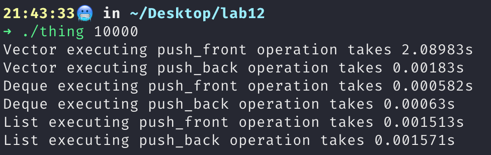
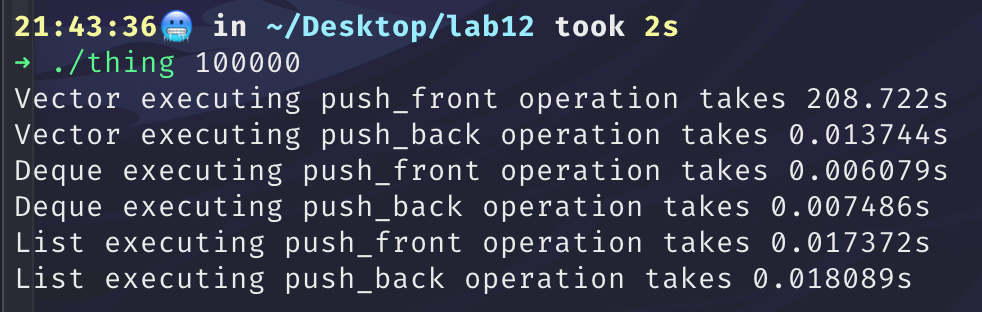
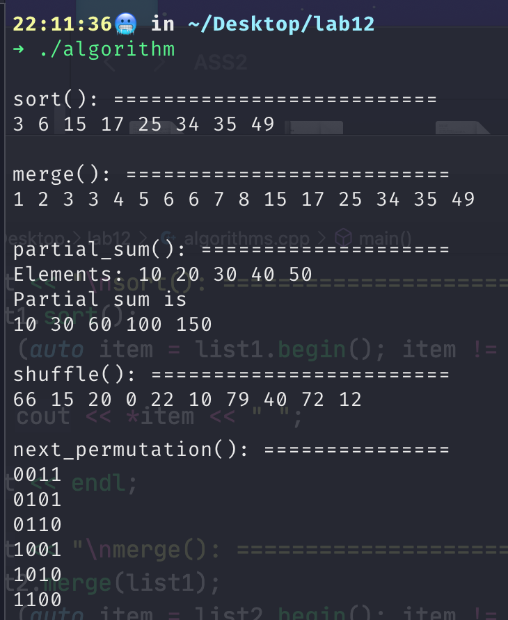

# LAB12

## Task 1
a). The difference lies in the order of the integers in the list.

b). After compile

```c++
./one
33
23
13
15
3
9
13
12
```

```c++
 ./two
33
23
12
13
9
15
13
3
```

c). The program uses the compint function to sort the integers in the list.

d). The original order of the list has a certain impact on the sorting result, which may cause it to be not the result that the programmer wants, so it may not be a good thing.

e). I don't wanna expect this behaviour, because regardless of the original order of the list, the result of the sorting algorithm should remain unchanged.

---
a). 
> g++ -std=c++11 -o three three.cpp

b). 
> ./three 1000

Time with reserved: 8.1e-05s

Time without reserved: 0.00011s

> ./three 10000

Time with reserved: 0.000461s

Time without reserved: 0.000805s

> ./three 1000000

Time with reserved: 0.037384s
 
 Time without reserved: 0.043544s

c). 
>./three 200000000

Time with reserved: 6.08396s

Time without reserved: 9.21663s

## Task 2
```C++
#include <iostream>
#include <string>
#include <vector>
#include <deque>
#include <list>
#include <chrono>
using namespace std;

class Thing
{
private:
    string th_name;
    int th_age;

public:
    Thing(string name, int age);
    void show() const;
};

Thing::Thing(string name, int age) : th_name(name), th_age(age)
{
}

void Thing::show() const
{
    cout << "Thing: " << th_name << " is " << th_age << " years old." << endl;
}

int main(int argc, char *argv[])
{
    unsigned int number = atoi(argv[1]);
    Thing myThing("The big blue dog", 5);

    list<Thing> lists;

    {
        vector<Thing> vThing;
        auto start = chrono::system_clock::now();

        for (unsigned int i = 0; i < number; i++)
        {
            vThing.insert(vThing.begin(), myThing);
        }

        auto end = chrono::system_clock::now();
        chrono::duration<double> elapsed_seconds = end - start;
        cout << "Vector executing push_front operation takes " << elapsed_seconds.count() << "s" << endl;
    }

    {

        vector<Thing> vThing2;
        auto start = chrono::system_clock::now();
        for (unsigned int i = 0; i < number; i++)
        {
            vThing2.push_back(myThing);
        }

        auto end = chrono::system_clock::now();
        chrono::duration<double> elapsed_seconds = end - start;
        cout << "Vector executing push_back operation takes " << elapsed_seconds.count() << "s" << endl;
    }

    {

        deque<Thing> dThing;
        auto start = chrono::system_clock::now();

        for (unsigned int i = 0; i < number; i++)
        {
            dThing.push_front(myThing);
        }

        auto end = chrono::system_clock::now();
        chrono::duration<double> elapsed_seconds = end - start;
        cout << "Deque executing push_front operation takes " << elapsed_seconds.count() << "s" << endl;
    }

    {

        deque<Thing> dThing2;
        auto start = chrono::system_clock::now();

        for (unsigned int i = 0; i < number; i++)
        {
            dThing2.push_back(myThing);
        }

        auto end = chrono::system_clock::now();
        chrono::duration<double> elapsed_seconds = end - start;
        cout << "Deque executing push_back operation takes " << elapsed_seconds.count() << "s" << endl;
    }
    {

        auto start = chrono::system_clock::now();

        for (unsigned int i = 0; i < number; i++)
        {
            lists.push_front(myThing);
        }

        auto end = chrono::system_clock::now();
        chrono::duration<double> elapsed_seconds = end - start;
        cout << "List executing push_front operation takes " << elapsed_seconds.count() << "s" << endl;
    }

    {

        auto start = chrono::system_clock::now();

        for (unsigned int i = 0; i < number; i++)
        {
            lists.push_back(myThing);
        }

        auto end = chrono::system_clock::now();
        chrono::duration<double> elapsed_seconds = end - start;
        cout << "List executing push_back operation takes " << elapsed_seconds.count() << "s" << endl;
    }

}
```





## Task3
```c++
#include <iostream>
#include <list>
#include <algorithm>
#include <string>
#include <random>
#include <iterator>

using namespace std;

static default_random_engine ran;
static uniform_int_distribution<unsigned> u(1, 50);


int main()
{
    list<int> list1, list2;

    list1.push_back(u(ran));
    list1.push_back(u(ran));
    list1.push_back(u(ran));
    list1.push_back(u(ran));
    list1.push_back(u(ran));
    list1.push_back(u(ran));
    list1.push_back(u(ran));
    list1.push_back(u(ran));

    list2.push_back(1);
    list2.push_back(2);
    list2.push_back(3);
    list2.push_back(4);
    list2.push_back(5);
    list2.push_back(6);
    list2.push_back(7);
    list2.push_back(8);

    cout << "\nsort(): ==========================" << endl;
    list1.sort();
    for (auto item = list1.begin(); item != list1.end(); ++item)
    {
        cout << *item << " ";
    }
    cout << endl;

    cout << "\nmerge(): ==========================" << endl;
    list2.merge(list1);
    for (auto item = list2.begin(); item != list2.end(); ++item)
    {
        cout << *item << " ";
    }
    cout << endl;

    cout << "\npartial_sum(): ====================" << endl;
    int val[] = {10, 20, 30, 40, 50};
    std::cout << "Elements: ";
    for (int i = 0; i < 5; i++)
    {
        std::cout << val[i] << " ";
    }
    std::cout << endl;
    int result[5];
    std::partial_sum(val, val + 5, result);
    std::cout << "Partial sum is" << endl;
    for (int i = 0; i < 5; i++)
    {
        std::cout << result[i] << " ";
    }
    cout << endl;

    cout << "\nshuffle(): ========================" << endl;
    std::vector<int> v = {10, 20, 40, 22, 66, 79, 72, 0, 12, 15};
    std::random_device rd;
    std::mt19937 g(rd());
    std::shuffle(v.begin(), v.end(), g);
    std::copy(v.begin(), v.end(), std::ostream_iterator<int>(std::cout, " "));
    cout << endl;

    cout << "\nnext_permutation(): ===============" << endl;
    std::string s = "0011";
    std::sort(s.begin(), s.end());
    do
    {
        std::cout << s << '\n';
    } while (std::next_permutation(s.begin(), s.end()));
}
```




