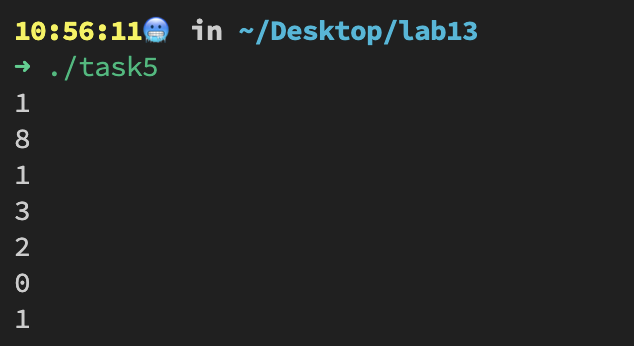

# LAB13
## Task 1
The quote refer to riddle's key whihc points the concept of 
*Encapsulation*.

## Task 2
```c++
enum Rainbow {
     VIOLET = 1,
     INDIGO,
     BLUE,
     GREEN,
     YELLOW,
     ORANGE,
     RED
};
```


## Task 3
```c++
#include <iostream>
using namespace std;

void reverse(istream& in, ostream& out) {
    char c;
    while (in.get(c)) {
        unsigned int charInt = static_cast<int>(c);
        if (charInt >= 97 && charInt <= 122) {
            c = (char)(charInt * -1 + 219);
        }
        out.put(c);
    }
}

int main() {
    reverse(cin, cout);

    return 0;
}
```


## Task 4
```c++
#include <iostream>
#include <vector>
using namespace std;

int main() {
    vector<string> phrases;

    cout << "Enter a phrase: ";

    string phrase;
    string reversed;

    while (getline(cin, phrase)) {
        if (phrase.compare("exit") == 0) {
            break;
        }

        reversed.clear();
        for (int i = phrase.size() - 1; i >= 0; --i) {
            reversed += phrase[i];
        }

        if (phrase.compare(reversed) == 0) {
            phrases.push_back(phrase);
            cout << "Palindrome!" << endl;
        } else {
            cout << "Not palindrome." << endl;
        }

        cout << "Enter another phrase or type exit: ";
    }

    cout << "\nPalindrome phrases:" << endl;
    for (auto it = phrases.begin(); it != phrases.end(); ++it) {
        cout << *it << endl;
    }

    return 0;
}
```


## Task 5
```c++
#include <iostream>
using namespace std;

class Mod11
{
private:
    int value;

public:
    Mod11(int n);
    void print() { cout << value << endl; }

    Mod11 operator+(const Mod11 &obj);
    Mod11 operator-(const Mod11 &obj);
    Mod11 operator*(const Mod11 &obj);
};

Mod11::Mod11(int n)
{
    value = n % 11;
}

Mod11 Mod11::operator+(const Mod11 &obj)
{
    return Mod11(value + obj.value);
}

Mod11 Mod11::operator-(const Mod11 &obj)
{
    return Mod11(value - obj.value);
}

Mod11 Mod11::operator*(const Mod11 &obj)
{
    return Mod11(value * obj.value);
}

int main()
{
    Mod11 m1(12);
    Mod11 m2(19);
    Mod11 m3(78);
    Mod11 m4(58);

    Mod11 m5 = m1 + m3;
    Mod11 m6 = m1 - m3;
    Mod11 m7 = m1 * m3;

    m1.print();
    m2.print();
    m3.print();
    m4.print();
    m5.print();
    m6.print();
    m7.print();

    return 0;
}
```

