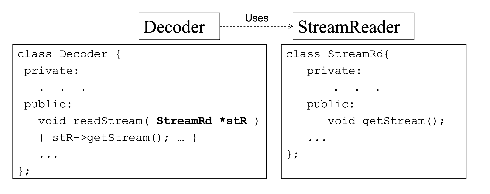

### C vs OO


### endl的作用
writes the stream out from the memory buffer to the ouptut stream and output a newline character
将缓冲区的流写到输出流并且输出一个换行符

### C++ 2 ways to pass varaibales to function
1.  pass by value, function don't need to change the value of the arguments
2. pass bu reference, function may change the arguments

### Pointers
pointers are not aliases, they are actual object.

### Passing by pointer vs passing by reference (指针 vs 引用）
1. pointers can be null and can be reassigned, references cannot be either. So, it's better to use constant or non- constant references to pass arguments.
2. 一旦引用被初始化为一个对象，就不能被指向到另一个对象。指针可以在任何时候指向到另一个对 象。
3. 引用必须在创建时被初始化。指针可以在任何时间被初始化

定义引用
> int i=17;int& r=i;

定义指针
> int var=20;int *ip;ip=&var

### new nad delete


```c++
float **fVar;

//allocate pointer array, 10 float pointers
fVar = new float* [10];

for (int i = 0; i < 10 ;++i)
                 // allocate memory to each
                fVar[i] = new float[10];
 
 for (int i = 0;  i< 10;++i}
                delete [] fVar [i];
 
 delete [] fVar;
```

### typedef, using ,auto, static function
```typedef int number;```

```number one, two, three;```


### Exception handling, namespace, 防御性编程
```c++
#include <iostream>
using namespace std;
 
double division(int a, int b)
{
   if( b == 0 )
   {
      throw "Division by zero condition!";
   }
   return (a/b);
}
 
int main ()
{
   int x = 50;
   int y = 0;
   double z = 0;
 
   try {
     z = division(x, y);
     cout << z << endl;
   }catch (const char* msg) {
     cerr << msg << endl;
   }
 
   return 0;
}
```


[namespace](https://www.runoob.com/cplusplus/cpp-namespaces.html)

An alternative to namespaces, to avoid name
duplication. 

**defensive programming**: that is, writing each procedure to defend itself against errors


### c++ detect possible erros 

+ eof(): indicates that the end of file is reached.
+ fail(): indicates a failure due to invalid data.
+ bad(): indicates a hardware problem.
+ good(): indicates a failure due to invalid data

### why buffer
It reduces the number of accessed to the external device.

###  union和struct
but the fields of a union all share the same memory.

### rand()的限制
+ can only get an integer
+ its a certain range which depends on the system
+ its not a uniform distribution

### static data members/ const members
const 定义的常量在超出其作用域之后其空间会被释放；而 static 定义的静态常量在函数执行后不会释放其存储空间

const 成员变量不能在类定义处初始化，只能通过构造函数初始化列表进行，并且必须有构造函数。const 数据成员 只在某个对象生存期内是常量，而对于整个类而言却是可变的，不同类可以用不同的const members。

简单来说，const  members 是对象相关的，const members的初始化只能在类的构造函数的初始化列表中进行；而static data members 是属于类的，即使没有实例化对象，依然可以直接用类访问。
 
 ```c++
#include <iostream>

using namespace std;

class Foo
{
public:
      Foo();
      //const成员变量初始化 方式1
      // Foo() : a(111){}
      const int a;  //只能在构造函数初始化列表中初始化
      static int b; //在类的实现文件中定义并初始化
      static const int c;
};

int Foo::b = 2;        //static成员变量不能在构造函数初始化列表中初始化，因为它不属于某个对象。
const int Foo::c = 10; //注意：给静态成员变量赋值时，不需要加st atic修饰符，但要加cosnt。

//const成员变量初始化，和对象生命周期相关
Foo::Foo() : a(111) {}

int main()
{
      Foo foo;
      //通过对象访问const 成员
      cout << foo.a << endl;
      //通过类直接访问static 成员
      cout << Foo::b << endl;
      return 0;
}

Output:
111
2
 ```

Static variables, declared as such in functions, persist beyond scope ({}), and aren't re-initialised with each call
to the function.

### makefile
`make` programming we describe how our program can be constructed from soucre files.

Construction sequence is described in a makefile which contains 

+ dependency 
+ construction rules

 ```c++
test: main.o
         g++ -o test main.o
main.o: main.cpp
         g++ -c main.cpp   
clean: rm *.o
```

### class
**definition of class**:

 + Classes provide a description for building objects.
 + Classes provide blueprints for objects.
 + Classes provide a convenient way to group related data and the functions which are used to process the data.
 + create an object from the class -> automatically create all the related fields.

**access specifiers types**:

+ **Public**: can be directly accessed from outside the object.
+  **Private**: can only be directly accessed by internal methods.
+  **Protected**: can be directly accessed by objects of subclasses, but not by arbitrary external objects.

**Encapsulation** is an example of making something a black box, to encapsulate components is to hide them in a container.


### UML图知识点
+ `+` represents public member
+ `-`  represents private member
+ `#` represents protected member
+ `/` represents dervied member
+ `~` represents package member

+ **Dependency** -> One class uses another class, or depends on it in someway


+ **Association** -> One class retains a relationship with another class,  described as a **"has a"**  type of relationship


+ **Aggregation** -> is a stronger Association that reflects "contains" or "owns"  type of relationship, A对象可以包含B对象，但B对象不是A对 象的一部分。 两个对象具有各自的生命周期。


+ **Composition** ->  is the strongest version of Association that reflects a "contains" or "owns" relationship, 是一种contains-a的关系，体现了严格的部分和整体关系，部分 和整体的生命周期一样


### member functions
inspector function:  Return information about an object’s state, or
display some or all of an object’s attributes.

mutator functions:  Functions that change an object’s attributes.
– setData() and processValue().

auxiliary functions: Functions to perform actions or services.

object Management functions: 1. constructors 2.desctructors

### Constructor and destructors
A Constructor function is called automatically each time an object is created.

+ Constructors are used to initialize the object in a specified way.
+ They are functions with the same name as the class, and no return type.

Destructors are called for an object whenever the object goes out of scope.

+ One destructor per class.
+ No parameters, no return type.

```c++

#include <iostream>
using namespace std;
class Line
{
public:
      void setLength(double len);
      double getLength(void);
      Line();
      ~Line();

private:
      double length;
};


Line::Line(void)
{
      cout << "Object is being created" << endl;
}
Line::~Line(void)
{
      cout << "Object is being deleted" << endl;
}
void Line::setLength(double len)
{
      length = len;
}
double Line::getLength(void)
{
      return length;
}


int main()
{
      Line line;
      line.setLength(6.0);
      cout << "Length of line : " << line.getLength() << endl;
      return 0;
}

Output:
Object is being created
Length of line : 6
Object is being deleted
```

### Copy constructor

拷⻉构造函数:拷⻉构造函数是一种特殊的**构造函数，函数的名称必须和类名称一致，它必须的 一个参数是本类型的一个引用变量**。

```c++
class Test
{
private:
      int a;

public:
      //构造函数
      Test(int b)
      {
            a = b;
            printf("constructor is called\n");
      }
      //拷⻉构造函数
      Test(const Test &t)
      {
            a = t.a;
            printf("copy constructor is called\n");
      }
      void Show()
      {
            cout << a << endl;
      }
};

int main()
{
      Test A(100);
      Test B = A;
      B.Show();
      return 0;
}

Output:
constructor is called
copy constructor is called
100
```


### overloading/overwriting/hiding
Functions are **overloaded** when they have the same name but different argument lists, cannot determined by return value.

+ in the same class
+ must have the same name
+ different argument lists.

**overwriting(override)**  is generally used for subclasses to override the methods in the parent class when inheriting from the parent class. Function features are the same, but the specific implementation is different.

The use of the override is designed to provide a check on the use of a base class.

+ the override function cannot be static, it must be `virtual`.
+ the override function must have the same type, name, and parameter list
+ Access specifiers for overridde functions can be different. virtual is private, but in derived class can be private, public and so on.

**hide**

+ not in the same scope (in base class and derived class respectively)
+ The name of the function must be the same
+ The derived class masks the base class function with the same name.

```c++
#include <iostream>
using namespace std;

class Base
{
private:
      virtual void display() { std::cout << "Base display()" << endl; }

      void say() { cout << "Base say()" << endl; }

public:
      void exec()
      {
            display();
            say();
      }

      void fun1(string a)
      {
            cout << "Base fun1(string)" << endl;
      }

      void fun1(int a)
      {
            cout << "Base fun1(int)" << endl;
      } //overload，两个fun1函数在Base类的内部被重载
};

class ChildA : public Base
{

public:
      void display() { cout << "ChildA display()" << endl; } //override，基类中的display为虚函数，故此处为重写（覆盖）

      void fun1(int a, int b) { cout << "ChildA fun1(int,int)" << endl; } //hide，fun1函数在Base类中不为虚函数，故此处为重定义

      void say() { cout << "ChildA say()" << endl; } //hide
};

class ChildB : public Base
{

public:
      void fun1(int a) { cout << "ChildB fun1(int)" << endl; } //hide
};

int main()

{
      ChildA a;
      Base *b = &a;
      b->exec();

      a.exec(); 
      a.say();
      ChildB c;
      c.fun1(1); 
}

Output:
ChildA display()
Base say()
ChildA display()
Base say()
ChildA say()
ChildB fun1(int)
```


### Inheritance restrictions
the following are never inherited:

+ constructors
+ destructors
+ `friend` functions (友元函数）
+ overloaded `new` operators
+ overloaded `=` operators
+ class frindeship

派生类想访问基类private成员，两种方式1. 写public的get()和set()方法 2. 把访问权限换成protected.


### operator overloading
Operator overloading allows you to define operators for your own abstract data types.

类名 operator` 操作符` (const 类名& 实例化变量名,....)

```
Box operator+(const Box& b)
      {
         Box box;
         box.length = this->length + b.length;
         box.breadth = this->breadth + b.breadth;
         box.height = this->height + b.height;
         return box;
}
```

### friend function
类的友元函数是定义在类外部，他既不是private也不是public，但有权访问类的所有私有(private)成员和保护(protected)成员。 尽管友元函数的原型有在类的定义中出现过，但是友元函数并不是成员函数。

友元可以是一个函数，该函数被称为友元函数;友元也可以是一个类，该类被称为友元类，在这种情况下，整个类及其所有成员都是友元。

```c++
 #include <iostream>
using namespace std;
class Box {
   double width;
public:
   friend void printWidth( Box box );
   void setWidth( double wid );
};

// 成员函数定义
void Box::setWidth( double wid ) 
{
width = wid; 
}
// 请注意:printWidth() 不是任何类的成员函数
//注意 不同于成员函数可以选择外部定义或者内部定义 友元函数只能外部定义 void printWidth( Box box )
{
/* 因为 printWidth() 是 Box 的友元，它可以直接访问该类的任何成员 */
   cout << "Width of box : " << box.width <<endl;
}
// 程序的主函数 int main( ) {
Box box;
// 使用成员函数设置宽度
box.setWidth(10.0); // 使用友元函数输出宽度
   printWidth( box );
   return 0;
}
```

## polymorphism
当类之间存在层次结构，并且类之间是通过继承关联时，就会用到多态。
C++ 多态意味着调用成员函数时，会根据调用函数的对象的类型来执行不同的函数.

**构成多态的条件**

1. The object calling the function must be a pointer or reference.
2. Classes that have at least one virtual function are referred to as being of polymorphic type.

```c++
#include <iostream>

using namespace std;

class Shape
{
protected:
      int width, height;

public:
      Shape(int a = 0, int b = 0)
      {
            width = a;
            height = b;
      }
      int area()
      {
            cout << "Parent class area :" << endl;
            return 0;
      }
};

class Rectangle : public Shape
{
public:
      Rectangle(int a = 0, int b = 0) : Shape(a, b) {}
      int area()
      {
            cout << "Rectangle class area :" << endl;
            return (width * height);
      }
};

class Triangle : public Shape
{
public:
      Triangle(int a = 0, int b = 0) : Shape(a, b) {}
      int area()
      {
            cout << "Triangle class area :" << endl;
            return (width * height / 2);
      }
};
// 程序的主函数
int main()
{
      Shape *shape;
      Rectangle rec(10, 7);
      Triangle tri(10, 5);
      // 存储矩形的地址 且是指针 
      shape = &rec;
      shape->area();

      shape = &tri;
      shape->area();
      return 0;
}

Output:
Parent class area :
Parent class area :

```
 
 
导致错误输出的原因是，调用函数 area() 被编译器设置为基类中的版本，这就是所谓的静态多态或者编译时多态（compile-time polymorphism），在程序编译时系统就能决定调用哪个函数，函数重载和运算符重载都属于静态多态。


 ```c++
class Shape
{
protected:
      int width, height;

public:
      Shape(int a = 0, int b = 0)
      {
            width = a;
            height = b;
      }
      virtual int area()
      {
            cout << "Parent class area :" << endl;
            return 0;
      }
};
 ```
 
 动态多态又叫运行时多态（runtime polymorphism)，动态多态性是在程序运行过程中才动态地确定操作所针对的对象，实际上就是通过虚函数实现。 
the derived function is said to override the base class function and we will have **dynamic binding.**

### 虚函数
虚函数 是在基类中使用关键字 virtual 声明的函数。在派生类中重新定义基类中定义的虚函数时，会告诉编译器不要静态链接到该函数。 我们想要的是在程序中任意点可以根据所调用的对象类型来选择调用的函数，这种操作被称为动态链接，或后期绑定。

**pure virtual function**

If you have a pure virtual function in the base class and don't have a definition of this function in a derived class, a pure virtual function will be inherited.

```c++
 class Shape {
   protected:
      int width, height;
   public:
};
Shape( int a=0, int b=0)
{
width = a;
height = b; }

// pure virtual function
virtual int area() = 0;
```

抽象类是指包括至少一个纯虚函数的类。

### multiple inheritance
用虚基类解决diamond 问题.

```c++
#include <iostream>

using namespace std;

class D
{
public:
      D() { cout << "D()" << endl; }
      ~D() { cout << "~D()" << endl; }

protected:
      int d;
};

class B : virtual public D
{
public:
      B() { cout << "B()" << endl; }
      ~B() { cout << "~B()" << endl; }

protected:
      int b;
};

class A : virtual public D
{
public:
      A() { cout << "A()" << endl; }
      ~A() { cout << "~A()" << endl; }

protected:
      int a;
};

class C : public B, public A
{
public:
      C() { cout << "C()" << endl; }
      ~C() { cout << "~C()" << endl; }

protected:
      int c;
};

int main()
{
      cout << "Here" << endl;
      C c;
      cout << sizeof(c) << endl;
      return 0;
}

Output:
这里C调用父类构造函数是根据继承的顺序public B->A
Here
D()
B()
A()
C()
40
~C()
~A()
~B()
~D()

如果不用virtual
D()
B()
D()
A()
C()
20
~C()
~A()
~D()
~B()
~D()

```

### RTTI
The program can use pointers or references to the base class to check the actual derived type of the object referred to by these pointers or references.

The `typeid` operator can be used to identify the actual type of an object obtaining this information from RTTI.


### derived pointer to base object
如果不是polymorphic的就没有意义，因为base object “is not” a derived object.

如果两者是polymorphic，那么可以用`dynamic_cast`，`static_cast`发生在编译阶段系统就能决定调用哪个函数，所以无用。

```c++
#include <iostream>

using namespace std;

class B
{
public:
      virtual void f() {}
};

class D : public B
{
public:
      void m()
      {
            cout << "Test " << endl;
      }
};

int main()
{
      D *p = dynamic_cast<D *>(new B(2));
      if (p != nullptr)
            p->m();
      else
            cerr << "Unsafe for p to point to a B" << endl;
}
```

+ **static_cast** takes place at the compilation stage and can prevent compilation errors, but this can result in meaningless runtime events in the context of the wrong object referencing.
+ **dynamic_cast** operator provides a mechanism for testing at runtime whether an object-based cast causes problems.It is useful to identify which type, which derived class, of object is pointed to by the base class pointer.
 + for safe upcast
 + There is multiple inheritance
  + We cast to or from type void*


### why RTTI
When we want to act through a pointer or reference to a base function, but cannot use virtual functions.

### Exception handling
+ An exception is a situation that the code is
unable to deal with.
+ An exception is also an object that is passed from the problem location to the location where the problem with be dealt with, or handled.


### create library
build a static library

```c++
CC -c code.cpp 
CC -xar -o libcode.a code.o

// sometimes to create the index of the library
ranlib libcode.a

// link it 
CC  driver.cpp libcode.a -o program
```

### copy/move constructor
copy constructor -> `X(const X&)`

move constructor ->  `X(X&&)`

Use move instead of copy when we wanna destroy the thign being copied immediately.  Move can be significantly more efficient than a copy and delete.

+ Roughly speaking, when we use an object as an rvalue, we use the object’s value (its contents).
+ When we use an object as an lvalue, we use the object’s identity (its location in memory).”

```c++
#include <iostream> 
#include <utility> 
using namespace std;

int main() {
                  int integer=10;
                  int &&rref=move(integer);
                  cout << rref << endl;
}
```

+ use `move` we need to be aware the value of the moved-from
object is no longer reliable.
 + the moved-from object needs to be safe to remove, or destructible.


### function templates and template functions

+ The **function templates** are the prototypes expressed in terms of the to-be-specified- later types.
+ The **template functions** are instantiations of those templates

The `function template` is a function blueprint that uses generic data types:

```c++
template <typenmae T> T function_name(T x){
           //主体
}
```
结合function overload，对相同名不同返回值的函数，`int reverse(int a)/double reverse(double a)`

```c++
template <typename T>
T reverse(T a){
     return (-a)
}
```

write a function template to swap two input value:

```c++
#include <iostream>

using namespace std;

template <typename T>
void invert(T &x, T &y)
{
      T temp;
      temp = x;
      x = y;
      y = temp;
}

int main()
{
      int x = 10;
      int y = 5;
      invert(x, y);
      cout << x << ":" << y << endl;

      return 0;
}
```


write a **function template** and the compiler generates one or more **template functions**, assuming there is at least one call to the function template.

### class templates
```c++

#include <iostream>
using namespace std;
template <typename T>
class Number
{
private:
      T theNumber;

public:
      Number(T n)
      {
            theNumber = n;
      }
      void display() { cout << theNumber << endl; }
};
int main()
{
      Number<int> n(10);
      Number<double> c(1.3);
      n.display();
      c.display();
}

//output
10
1.3
```

### containers and iterators
Containers are objects that store a collection of other objects.

An **terator** is an object that moves through a container of other objects and selects them one at a time **without providing direct access to the implementation of that container.**

the **auto** keyword directs the compiler to use the initialization expression of a declared variable, or lambda expression parameter, to deduce its type.

```c++
int a = 10;
// 自动推断au_a 为int类型
auto au_a = 1;
cout << typeid(au_a).name() << endl;

// output
int
```


use `cbegin()` and `cend()` in place of `begin()` and `end()` to get `const` iterators.

### STL
The Standard Template Library (STL) is a set of C++ template classes to provide common programming data structures and functions such as lists, stacks, arrays, etc. It is a library of container classes, algorithms, and iterators.

It's used to provide reusable and widely adaptable solutions, that are never-the-less efficient.


**the purpose of STL**: STL aims to do as well as you could if you crafted non-templated code.

**useage case**: Code reuse, the code has already been written and tested.


 Containers:
 
 1. **Sequential containers** : the elements are organised linearly
 2. **Associative containers**: the elements are not necessarily

vector operation:

+ Initialisation with values: `vector<int> v1(10, -1)`
+ Iterator based construction: `vector<int> v5(v4.begin(),v4.end());`
+ List initialisation: C++ 11: `vector<int> numbers{1,2,3,4,5,6,7};`
+ void push_back(const T& x);
+ void push_front(const T& x); //for deque 
+ void pop_back();
+ void pop_front(); // for deque


 ```c++
#include <iostream>
#include <vector>
using namespace std;
int main()
{
      // 创建一个向量存储
      vector<int> vec;
      int i;

      // 显示 vec 的原始大小
      cout << "vector size = " << vec.size() << endl;

      // 推入 5 个值到向量中
      for (i = 0; i < 5; i++)
      {
            vec.push_back(i);
      }

      // 显示 vec 扩展后的大小
      cout << "extended vector size = " << vec.size() << endl;

      // 访问向量中的 5 个值
      for (i = 0; i < 5; i++)
      {
            cout << "value of vec [" << i << "] = " << vec[i] << endl;
      }

      // 使用iterator 访问
      vector<int>::iterator v = vec.begin();
      while (v != vec.end())
      {
            cout << "value of v = " << *v << endl;
            v++;
      }
      return 0;
}
```

Reverse iterators  use `rbegin()` and `rend()`.

```c++
#include <iostream>
#include <vector>
using namespace std;
int main()
{
      vector<char> c;
      c.push_back('A');
      c.push_back('B');
      c.push_back('C');
      cout << "Forward:\n";
      vector<char>::iterator p;
      for (p = c.begin(); p != c.end(); p++)
            cout << *p << " ";
      cout << endl;
      cout << "Reverse:\n";
      vector<char>::reverse_iterator rp;
      for (rp = c.rbegin(); rp != c.rend(); rp++)
            cout << *rp << " ";
      cout << endl;
      return 0;
}
```


,